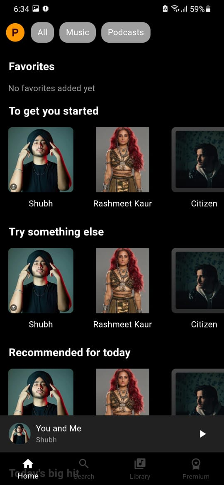
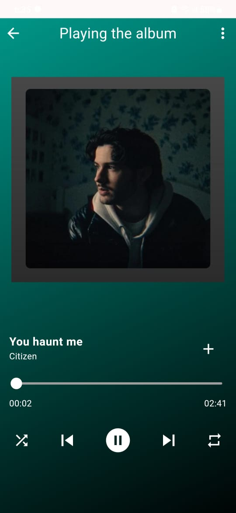

# Spotify Clone with GetX and Just Audio

## Description

This is a **Spotify Clone** built using **Flutter**, utilizing **GetX** for state management and **Just Audio** for handling audio playback. The app offers a seamless music listening experience, allowing users to search for songs, play music, and browse through playlists similar to the popular **Spotify** app. The app is designed to be intuitive, with smooth navigation and audio controls.

---

## Features

- **Search for Songs**: Find your favorite tracks, albums, and artists quickly.
- **Audio Playback**: Play music seamlessly using **Just Audio** for optimal audio management.
- **Playlists**: Browse and manage playlists, similar to Spotify’s functionality.
- **State Management with GetX**: Efficiently handle state changes and navigation with **GetX**.
- **Responsive UI**: Optimized for both mobile and tablet screens.
- **Now Playing Screen**: View the currently playing song and control playback.

---

## Installation

### Prerequisites

- Flutter 3.0 or higher
- Dart 2.18 or higher

### Steps to Set Up

1. **Clone the repository**:
   ```bash
   git clone https://github.com/PreritSaini/spotify-clone.git

### Screenshots
- **Here are some screenshots of the app**:

 Home Screen - Browse your favorite songs, albums, and playlists .
 Search Screen - Search for songs, albums, and artists.
## Screenshot


## Screenshot


## Screenshot




Now Playing - Control music playback with a seamless interface.


